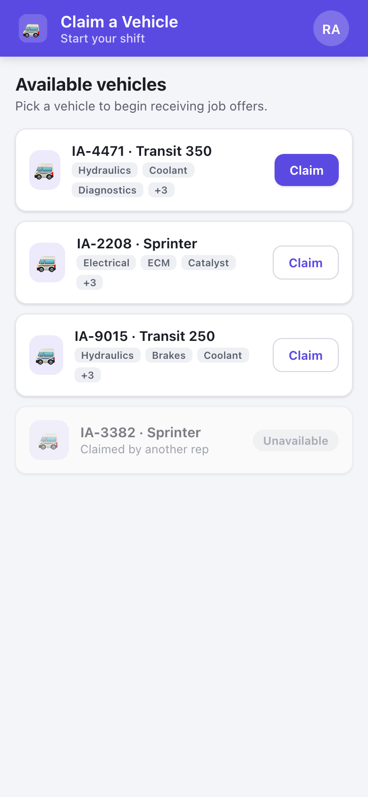

# UI Mockups — Service Delivery

Generated UI design images for **all three personas across every platform they support**, built
directly from [`../ui-design-brief.md`](../ui-design-brief.md) and honoring the persona→platform
matrix in [ADR-0008](../adr/0008-persona-platform-support.md).

## How these were made (and why they share a look)

Every screen is composed from **one shared component library** — [`design-system.css`](design-system.css) —
not drawn per image. The stylesheet defines the design tokens and reusable components once
(app bar, cards, chips, tier badges, buttons, map markers, dialogs, countdown, bottom sheet, …),
mirroring the MudBlazor theme-token strategy from [ADR-0007](../adr/0007-mudblazor-component-library.md).
The domain colors are defined a single time and referenced everywhere:

- **Rep-state marker colors** — Available 🟢 · En Route 🔵 · Within 15 mi 🟡 · On Site 🔴 · Offline ⚪
- **Tier badges** — Bronze · Silver · Gold

Change a token in `design-system.css` and every screen updates consistently — that is the shared
look-and-feel, enforced structurally rather than by hand.

Screens live in [`screens/`](screens/) as HTML composed from those classes. They are rendered to PNG by
[`render.mjs`](render.mjs), which drives headless Chrome over the DevTools Protocol at each platform's
exact viewport (2× for crispness).

> **Maps** are stylized placeholders — the real app uses Google Maps (per the brief). The mockups show
> marker color semantics, routes, and ETA overlays, not real tiles.

### Regenerate

```bash
node docs/ui-mockups/render.mjs    # requires Node + Google Chrome; overwrites images/
```

---

## The shared component library


---

## Shared — Authentication (FE-001)

The login screen is identical for every persona; routing to the persona view happens by JWT role.

| Web / Desktop | Mobile |
|:---:|:---:|
|  |  |

---

## Dispatcher — Desktop + Web

Dense command-center dashboard: live fleet map (color-coded markers, popover, legend), the priority-ordered
request queue, the offline alert banner (FE-006), and the redirect confirmation dialog (FE-005).
**Not built for mobile** (ADR-0008).

### Fleet dashboard — FE-003 / FE-004 / FE-006

**Desktop (1440)**


**Web (1280)**


### Redirect confirmation — FE-005


---

## Service Rep — Mobile only

Single-task, touch-first field experience. **Not built for desktop/web** (ADR-0008).

| Claim a vehicle (FE-007) | Job offer + countdown (FE-008) | Active job navigation (FE-011/012) |
|:---:|:---:|:---:|
|  |  |  |

---

## Requester — Desktop + Web + Mobile

Consumer-grade, responsive from phone to desktop. Submit → finding → tracking → complete.

### Submit a request — FE-015

| Web / Desktop | Mobile |
|:---:|:---:|
|  |  |

### Live rep tracking — FE-017

| Web / Desktop | Mobile |
|:---:|:---:|
|  |  |

### Finding a technician (FE-016) · Service complete (FE-019)

| Finding — Mobile | Complete — Mobile |
|:---:|:---:|
|  |  |

---

## File map

```
docs/ui-mockups/
├── README.md            ← this index
├── design-system.css    ← the shared component library (single source of truth)
├── render.mjs           ← CDP renderer: screens/*.html → images/*.png
├── screens/             ← one HTML file per screen, composed from design-system.css
└── images/              ← generated PNGs (persona__platform-WxH.png)
```

## Coverage vs. the persona platform matrix

| Persona | Desktop | Web | Mobile |
|---------|:-------:|:---:|:------:|
| Dispatcher | ✅ | ✅ | — (n/a) |
| Service Rep | — (n/a) | — (n/a) | ✅ |
| Requester | ✅ | ✅ | ✅ |

Login is shown on Web + Mobile as representative of all hosts. Requester Desktop and Web share the same
responsive layout (shown once as "Web / Desktop").
